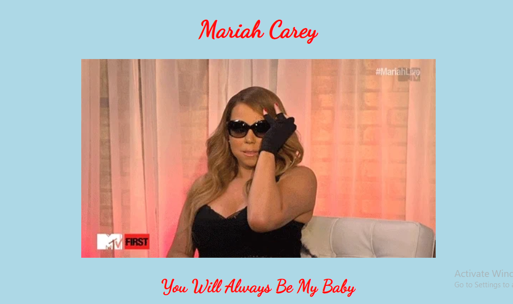

# Mariah Carey Fan Page

I created a web application utilizing Express and Node.js for any Mariah Carey fans to look at gifs of her, leave comments, and "Like" and "Heart" the comments. Show the Queen of Christmas some love!

## How It's Made

**Tech Used:** HTML, CSS, Javascript, Express, Node.js, Mongo DB

This website is a page that allows the client to post a message, view gifs, and "like" and "heart" any messages that were left on the page. All results are held in a database, so if the person with the same credentials logs back in, they can see the previous results.

## Installation

1. Clone repo
2. run `npm install`

## Usage

1. run `node server.js`
2. Navigate to `localhost:3000`
